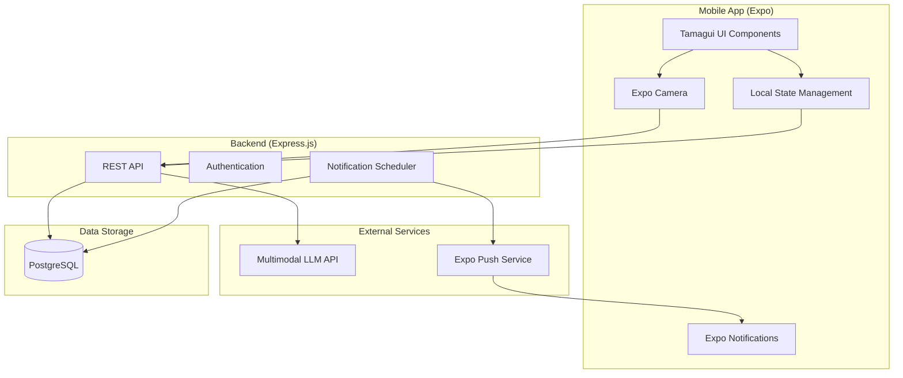
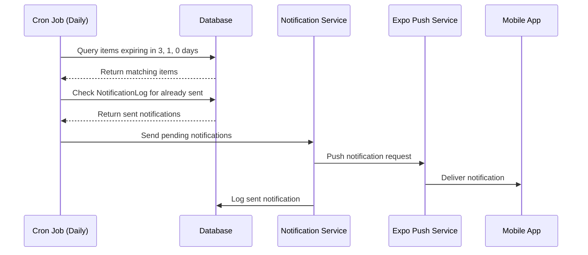

# Design Document

## Overview

FoodTracker is a mobile application built with React Native (Expo) that helps users track food expiration dates. The app uses a multimodal LLM to scan shopping receipts, extract food items, and estimate expiration dates. Users can view their food inventory as color-coded cards, manually adjust dates, and receive push notifications before items expire.

The system consists of:
- **Mobile App**: React Native (Expo) with Tamagui UI components
- **Backend API**: Express.js with TypeScript
- **Database**: PostgreSQL for persistent storage
- **AI Service**: Integration with a multimodal LLM (OpenAI GPT-4 Vision or similar)
- **Push Notifications**: Expo Push Notifications service

## Architecture



## Components and Interfaces

### Mobile App Components

```
src/
├── app/                          # Expo Router screens
│   ├── (tabs)/
│   │   ├── _layout.tsx          # Tab navigation layout
│   │   ├── index.tsx            # Home/Food list screen
│   │   └── scan.tsx             # Camera scan screen
│   ├── food/
│   │   └── [id].tsx             # Food item detail screen
│   └── _layout.tsx              # Root layout
├── components/
│   ├── FoodCard.tsx             # Food item card with traffic light
│   ├── FoodCardList.tsx         # Scrollable list of food cards
│   ├── CameraView.tsx           # Camera viewfinder component
│   ├── ExpirationBadge.tsx      # Traffic light status badge
│   ├── DatePicker.tsx           # Date selection component
│   ├── LoadingSpinner.tsx       # Loading indicator
│   └── EmptyState.tsx           # Empty list placeholder
├── hooks/
│   ├── useFoodItems.ts          # Food items data fetching
│   ├── useCamera.ts             # Camera permissions and capture
│   └── useNotifications.ts      # Push notification setup
├── services/
│   ├── api.ts                   # API client
│   └── storage.ts               # Local storage utilities
├── types/
│   └── index.ts                 # TypeScript type definitions
└── utils/
    ├── dateUtils.ts             # Date formatting and calculations
    └── statusUtils.ts           # Traffic light status logic
```

### Component Specifications

#### FoodCard Component
```typescript
interface FoodCardProps {
  id: string;
  name: string;
  purchaseDate: Date;
  expirationDate: Date;
  status: TrafficLightStatus;
  isEstimated: boolean;
  onPress: () => void;
  onDelete: () => void;
}

type TrafficLightStatus = 'green' | 'yellow' | 'red';
```

#### CameraView Component
```typescript
interface CameraViewProps {
  onCapture: (imageUri: string) => void;
  onError: (error: Error) => void;
  mode: 'receipt' | 'label';
}
```

#### ExpirationBadge Component
```typescript
interface ExpirationBadgeProps {
  status: TrafficLightStatus;
  daysUntilExpiration: number;
}
```

### Backend API Endpoints

| Method | Endpoint | Description |
|--------|----------|-------------|
| GET | `/api/food-items` | Get all food items for user |
| GET | `/api/food-items/:id` | Get single food item |
| POST | `/api/food-items` | Create food item(s) |
| PUT | `/api/food-items/:id` | Update food item |
| DELETE | `/api/food-items/:id` | Delete food item |
| POST | `/api/scan/receipt` | Process receipt image |
| POST | `/api/scan/label` | Process product label image |
| POST | `/api/notifications/register` | Register push token |

### Backend Structure

```
server/
├── src/
│   ├── index.ts                 # Express app entry point
│   ├── routes/
│   │   ├── foodItems.ts         # Food items CRUD routes
│   │   ├── scan.ts              # Image scanning routes
│   │   └── notifications.ts     # Notification routes
│   ├── controllers/
│   │   ├── foodItemController.ts
│   │   ├── scanController.ts
│   │   └── notificationController.ts
│   ├── services/
│   │   ├── llmService.ts        # Multimodal LLM integration
│   │   ├── notificationService.ts
│   │   └── expirationEstimator.ts
│   ├── models/
│   │   └── FoodItem.ts          # Database model
│   ├── middleware/
│   │   ├── errorHandler.ts
│   │   └── validation.ts
│   ├── types/
│   │   └── index.ts
│   └── utils/
│       └── dateUtils.ts
├── prisma/
│   └── schema.prisma            # Database schema
└── package.json
```

## Data Models

### Database Schema (Prisma)

```prisma
model User {
  id            String      @id @default(uuid())
  pushToken     String?
  createdAt     DateTime    @default(now())
  updatedAt     DateTime    @updatedAt
  foodItems     FoodItem[]
}

model FoodItem {
  id              String      @id @default(uuid())
  name            String
  purchaseDate    DateTime
  expirationDate  DateTime
  isEstimated     Boolean     @default(true)
  imageUrl        String?
  userId          String
  user            User        @relation(fields: [userId], references: [id])
  createdAt       DateTime    @default(now())
  updatedAt       DateTime    @updatedAt
  
  @@index([userId])
  @@index([expirationDate])
}

model NotificationLog {
  id            String      @id @default(uuid())
  foodItemId    String
  type          String      // 'three_day' | 'one_day' | 'expiry_day'
  sentAt        DateTime    @default(now())
  
  @@unique([foodItemId, type])
}
```

### TypeScript Types (Shared)

```typescript
// types/index.ts

export interface FoodItem {
  id: string;
  name: string;
  purchaseDate: string; // ISO date string
  expirationDate: string; // ISO date string
  isEstimated: boolean;
  imageUrl?: string;
  createdAt: string;
  updatedAt: string;
}

export interface CreateFoodItemInput {
  name: string;
  purchaseDate: string;
  expirationDate: string;
  isEstimated?: boolean;
}

export interface UpdateFoodItemInput {
  name?: string;
  expirationDate?: string;
  isEstimated?: boolean;
}

export interface ScanReceiptResponse {
  items: ExtractedFoodItem[];
  rawText?: string;
}

export interface ExtractedFoodItem {
  name: string;
  estimatedExpirationDays: number;
  confidence: number;
}

export interface ScanLabelResponse {
  expirationDate: string | null;
  confidence: number;
}

export type TrafficLightStatus = 'green' | 'yellow' | 'red';

export interface FoodItemWithStatus extends FoodItem {
  status: TrafficLightStatus;
  daysUntilExpiration: number;
}
```

### LLM Prompt Templates

#### Receipt Scanning Prompt
```
Analyze this shopping receipt image and extract all food items.
For each food item, provide:
1. The item name (normalized, e.g., "Milk" not "2% MILK 1GAL")
2. Estimated days until expiration based on typical shelf life

Return as JSON array:
[
  { "name": "string", "estimatedExpirationDays": number, "confidence": 0-1 }
]

Only include food items, not household products or non-perishables.
If no food items are found, return an empty array.
```

#### Label Scanning Prompt
```
Analyze this product label/packaging image and extract the expiration date.
Look for: "Best By", "Use By", "Exp", "BB", or similar date indicators.

Return as JSON:
{
  "expirationDate": "YYYY-MM-DD" or null if not found,
  "confidence": 0-1
}
```

## Error Handling

### Error Response Format
```typescript
interface ApiError {
  code: string;
  message: string;
  details?: Record<string, unknown>;
}
```

### Error Codes
| Code | HTTP Status | Description |
|------|-------------|-------------|
| `CAMERA_PERMISSION_DENIED` | 403 | Camera access not granted |
| `IMAGE_PROCESSING_FAILED` | 422 | LLM could not process image |
| `NO_ITEMS_FOUND` | 200 | No food items extracted (not an error) |
| `FOOD_ITEM_NOT_FOUND` | 404 | Requested food item doesn't exist |
| `VALIDATION_ERROR` | 400 | Invalid input data |
| `NETWORK_ERROR` | 503 | Backend unreachable |

### Offline Handling
- Queue failed API calls in AsyncStorage
- Sync queued operations when connectivity restored
- Show offline indicator in UI
- Allow viewing cached food items offline

## Testing Strategy

### Unit Tests
- **Utils**: Date calculations, status determination logic
- **Components**: Render tests for FoodCard, ExpirationBadge
- **Services**: API client methods, LLM service parsing

### Integration Tests
- **API Routes**: CRUD operations for food items
- **Scan Flow**: Receipt image → LLM → parsed items
- **Notification Scheduling**: Correct timing of notifications

### E2E Tests (Detox)
- Complete scan flow: camera → confirmation → saved items
- Manual date editing flow
- Notification tap → navigation to item

### Test Coverage Targets
- Unit tests: 80% coverage on utils and services
- Integration tests: All API endpoints
- E2E tests: Critical user flows

## Notification Scheduling



### Notification Schedule
- **Daily cron job** runs at 9:00 AM local time
- Queries food items with expiration dates matching:
  - Today + 3 days (3-day warning)
  - Today + 1 day (1-day warning)
  - Today (expiry day)
- Checks NotificationLog to avoid duplicates
- Sends batch notifications via Expo Push API
